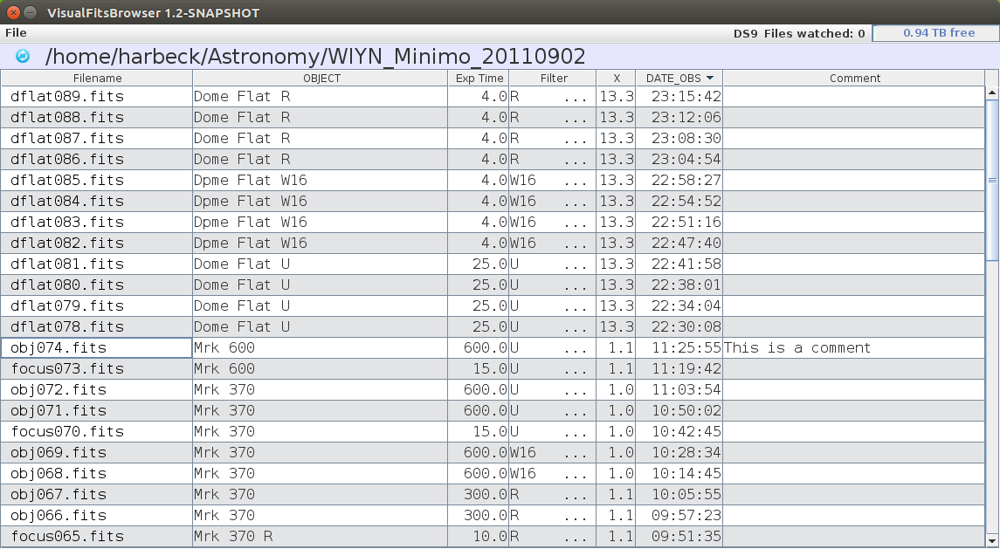

# File browser

The main window lists the FITS images in one directory.

## The file table

Every file ending in `.fit`, `.fits` or `.fits.fz` is listed with these columns:

| Column | Source |
|---|---|
| Filename | File name. A leading `·` marks a binned image (`CCDSUM` binning greater than 1 in both axes). |
| OBJECT | `OBJECT` header keyword |
| Exp Time | `EXPTIME` (or `REQ_EXPT`) |
| Filter | `FILTER` |
| X | `AIRMASS` |
| DATE_OBS | `DATE-OBS` |
| *(no title)* | `CONFMODE` keyword, or `n/a` if the header has none |
| Comment | Your [comment](comments.md) for this image — editable |

Click a column header to sort. The default order puts the newest image
(`DATE-OBS`) on top. Hover over a cell to see its full content as a tooltip.

The image currently shown in ds9 is highlighted in **bold magenta**.

### Directory header

Above the table:

- the **reload** icon re-reads the directory from scratch (same as
  **File → Reload Directory**, `Alt+R`);
- the current directory path;
- **`<` / `>`** buttons, shown only when the directory path contains a date in
  `YYYYMMDD` form (for example `/data/raw/20240315`). They jump to the same path
  with the date one day earlier or later, if that directory exists. This is handy
  for observatory "day directories".

### Disk space indicator

The bar at the right end of the menu bar shows the free space on the disk that
holds the current directory. It turns from green to a warning colour when the
disk is more than 80 % full.

## Watching for new files

After a directory has been read, a background listener checks it for new files.
The directory is polled about once per second. A new file is added to the table
once it is at least one FITS block (2880 bytes) long. With auto-display enabled,
the program waits another second before sending it to ds9, to give the camera time
to finish writing.

Some network file systems do not update a directory's modification time when files
are added. If new files do not appear, set
`directorylistener.ignorediremodified=true` (see [Configuration](../configuration.md)).

## Displaying images in ds9

| Action | Result |
|---|---|
| Double-click a row (left button) | Display in ds9 frame 0 |
| Double-click with middle / right button | Display in ds9 frame 1 / 2 |
| Shift + double-click | Uncompress with `funpack` first, then display |
| **File → Send all selected to ds9** (`Alt+A`) | Clear all ds9 frames, load each selected image into its own frame, and lock scale, colour bar and frame alignment across frames |
| **File → Auto display new image in ds9** | Every newly arriving image is shown in ds9 automatically, about one second after it appears |

Multi-extension (mosaic) FITS files are loaded as mosaics automatically.

## Other actions

- **File → Send all selected to clipboard** (`Ctrl+Shift+C`) copies the full paths
  of the selected files, space separated, for use in a terminal.
- **File → Show ToolBox** opens [the Toolbox](toolbox.md).
- **File → Generate PDF logfile** creates a [log sheet](logsheets.md).
- **File → Exit** (`Alt+Q`) quits and saves window positions and settings.
- **Help → Documentation** opens this documentation in your web browser;
  **Help → About** shows the program version.
