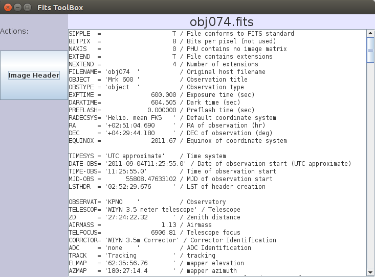

# The Toolbox

The Toolbox is a separate window with quick-look tools. Open it with
**File → Show ToolBox**; its position and visibility are remembered between
sessions.

The buttons on the left choose a tool; the area on the right shows its result.

## Image Header

Shows the FITS header of the image selected in the file table, read-only. For
files with extensions (including compressed `.fits.fz` files), the primary header
is followed by the header of the first extension.

- While the header view is active, selecting another image in the file table
  updates the header view right away. Move through the table with the arrow keys
  to step through headers.
- The scroll position is kept when you switch images, so a keyword you are looking
  at stays in view for the next file.
- Type into the **search field** below the header to highlight the first match
  (case-insensitive). Typing continues the search from the current match.

## Imexam

An interactive star and line profile tool that works together with ds9, similar to
IRAF's `imexam`.

1. Display an image in ds9.
2. Click **Imexam** in the Toolbox. ds9 now waits for a key press.
3. Point at a star or feature in the ds9 window and press a key:
    - **`r`** — radial profile: plots pixel value against distance from the
      centroid, with a Gaussian fit.
    - **`x`** — line profile along x, using a band ±2 pixels around the centroid.
      Use this to measure the width of spectral lines.
    - any other key repeats the last profile mode (x-line at first).
    - **`q`** — stop imexam mode.
4. VisualFitsBrowser fetches a 50 × 50 pixel cutout around the cursor from ds9 and
   shows:
    - the cutout, with an adjustable intensity scale;
    - the profile plot;
    - centroid and peak position (in image pixels), FWHM, peak above background,
      sky level and noise, aperture flux and instrumental magnitude.

After each measurement ds9 is armed again, so you can keep pressing keys on more
objects until you press `q`.

## Adding your own tool

See [Adding a Toolbox tool](../developer/adding-a-tool.md).
